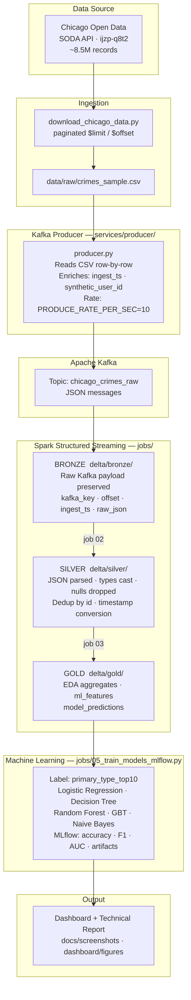

# Chicago Crime Big Data Streaming & ML Pipeline

<div align="center">


**Büyük Veri Analizine Giriş — dönem projesi · end-to-end streaming analytics pipeline**

</div>

---

## 1. Project Overview

This project implements a **production-grade, end-to-end big data pipeline** on the Chicago Crime dataset (~8.5M records). It demonstrates the full modern data engineering and data science stack:

| Component | Technology | Purpose |
|-----------|-----------|---------|
| Containerization | Docker / Docker Compose | Reproducible environment |
| Message Streaming | Apache Kafka | Real-time crime event simulation |
| Stream Processing | Apache Spark Structured Streaming | Stateful transformations |
| Storage | Delta Lake (Bronze / Silver / Gold) | Lakehouse architecture |
| Machine Learning | Spark MLlib + MLflow | Crime type prediction & experiment tracking |
| Visualization | Matplotlib / Seaborn / Plotly | EDA + dashboard |

**ML Goal:** Predict the top-10 most frequent crime types (`primary_type`) from spatial and temporal features — no data leakage (IUCR/description columns excluded).

---

## 2. Architecture



---

## 3. Dataset

| Property | Details |
|----------|---------|
| **Source** | [Chicago Data Portal — Crimes 2001 to Present](https://data.cityofchicago.org/Public-Safety/Crimes-2001-to-Present/ijzp-q8t2) |
| **Volume** | ~8.5M records (ID counter as of 2026) |
| **Update cadence** | Daily, excluding last 7 days |
| **API** | Socrata SODA — paginated via `$limit` / `$offset` |
| **Format** | JSON (API) / CSV (bulk download) |

**Key columns used:**

```
id · date · primary_type · location_description
district · ward · community_area · latitude · longitude
domestic · arrest · beat
```

> **Privacy note:** Addresses are provided at block level only. No precise address
> inference is performed. `synthetic_user_id` fields in Kafka messages are
> deterministic hash values — no real user data is involved.

**Excluded from ML features** (data leakage risk):
- `iucr` — directly encodes primary_type
- `description` — sub-description of primary_type
- `arrest` — post-event information, not available at prediction time

---

## 4. How to Run

### Prerequisites

- Docker Desktop ≥ 24 with Docker Compose v2
- 8 GB RAM allocated to Docker
- ~5 GB free disk space

### Quick start

```bash
# 1. Clone the repo
git clone https://github.com/EmircanKartal/chicago-crime-bigdata-pipeline.git
cd chicago-crime-bigdata-pipeline

# 2. Download sample data (100K records)
python scripts/download_chicago_data.py

# 3. Start all services
docker compose up -d

# 4. Verify services are running
docker compose ps
```

### Service ports

| Service | Port | UI |
|---------|------|----|
| Kafka Broker | 9092 | — |
| Zookeeper | 2181 | — |
| Spark Master | 7077 | http://localhost:8080 |
| MLflow Tracking | 5000 | http://localhost:5000 |

### Run the pipeline manually

```bash
# Create Kafka topic
bash scripts/create_kafka_topic.sh

# Start producer (simulates streaming at 10 msg/sec)
docker compose exec producer python app/producer.py

# Run Delta pipeline jobs (in order)
docker compose exec spark spark-submit jobs/01_stream_kafka_to_bronze.py
docker compose exec spark spark-submit jobs/02_bronze_to_silver.py
docker compose exec spark spark-submit jobs/03_silver_to_gold.py

# Train ML models and log to MLflow
docker compose exec spark spark-submit jobs/05_train_models_mlflow.py
```

---

## 5. Kafka Producer

Located in `services/producer/app/producer.py`

**Message format (JSON per record):**

```json
{
  "ingest_ts": "2026-04-27T21:10:00Z",
  "producer_id": "producer-1",
  "synthetic_user_id": "user_48291",
  "event_id": "14173521",
  "related_id": "JJ123456",
  "event_time": "2024-04-14T00:00:00.000",
  "event_type": "THEFT",
  "primary_type": "THEFT",
  "location_description": "STREET",
  "district": "001",
  "ward": 42,
  "community_area": "32",
  "latitude": 41.88,
  "longitude": -87.63,
  "domestic": false,
  "source": "Chicago Open Data"
}
```

**Configuration (environment variables):**

```bash
PRODUCE_RATE_PER_SEC=10   # messages per second (tested up to 100/sec)
KAFKA_TOPIC=chicago_crimes_raw
KAFKA_BOOTSTRAP_SERVERS=kafka:9092
```

---

## 6. Spark + Delta Pipeline

### Bronze layer — `delta/bronze/`

Raw preservation layer. Every Kafka message stored as-is.

```
kafka_key · kafka_value · topic · partition · offset · kafka_timestamp · ingest_ts · raw_json
```

### Silver layer — `delta/silver/`

Cleaned and typed layer.

- `id` null → drop
- `date` → cast to `TimestampType`
- `latitude` / `longitude` null → exclude from spatial analysis
- `district`, `ward`, `community_area` → cast to correct types
- Deduplication by `id`
- `primary_type` null → drop; `location_description` null → `"UNKNOWN"`

### Gold layer — `delta/gold/`

Analytics-ready aggregates and ML feature table.

| Table | Description |
|-------|-------------|
| `gold_crime_daily_counts` | Trend analysis |
| `gold_crime_hourly_counts` | Time-of-day patterns |
| `gold_crime_by_district` | Geographic distribution |
| `gold_crime_by_type` | Class frequency |
| `gold_ml_features` | Feature-engineered ML input |
| `gold_model_predictions` | Model output with ground truth |

---

## 7. EDA

Key findings from `notebooks/03_eda.ipynb`:

- **Temporal patterns:** Theft peaks in summer months; violent crime spikes on weekend nights
- **Geographic concentration:** Districts 6, 8, 11 consistently show highest crime density
- **Time of day:** 12:00 and 20:00 show dual daily peaks across most crime types
- **Domestic crimes:** Concentrated in residential community areas; strong seasonal signal

EDA visualizations (see `dashboard/figures/`):
```
├── yearly_trend.png
├── hourly_distribution.png
├── top10_crime_types.png
├── district_heatmap.png
├── location_description_distribution.png
├── domestic_arrest_comparison.png
├── weekday_hour_heatmap.png
└── missing_values.png
```

---

## 8. Feature Engineering

Implemented in `jobs/04_feature_engineering.py` and `notebooks/04_feature_engineering.ipynb`.

| Feature | Source | Rationale |
|---------|--------|-----------|
| `hour` | `date` | Hourly crime patterns |
| `day_of_week` | `date` | Weekday vs. weekend behaviour |
| `month` | `date` | Seasonality |
| `is_weekend` | `day_of_week` | Social mobility signal |
| `is_night` | `hour` (20:00–06:00) | Night/day crime shift |
| `district` | raw | Regional crime patterns |
| `community_area` | raw | Neighbourhood-level context |
| `location_description_group` | `location_description` | Grouped: STREET · RESIDENCE · STORE · SCHOOL · OTHER |
| `lat_grid` / `lon_grid` | `latitude` / `longitude` | Rounded to 2 decimals — point location without overfitting |
| `domestic` | raw | Correlates with specific crime subtypes |

**Label:** `primary_type_top10` — top 10 crime types by frequency; all others → `OTHER`

---

## 9. Machine Learning & MLflow

### Models trained

| # | Model | Notes |
|---|-------|-------|
| 1 | Logistic Regression | Baseline, L2 regularized |
| 2 | Decision Tree Classifier | Max depth tuned, interpretable |
| 3 | Random Forest Classifier | 100 trees, most robust |
| 4 | Gradient Boosted Trees | Binary sub-experiment (THEFT vs. NOT_THEFT) for AUC-ROC |
| 5 | Naive Bayes | Multinomial, fastest inference |

### MLflow tracked per run

```
model_name · target · train_rows · test_rows
features · parameters
accuracy · weighted_f1 · weighted_precision · weighted_recall · auc_macro_ovr
artifacts: confusion_matrix.png · roc_curve.png · feature_importance.png · model_artifact
```

### Access MLflow UI

```bash
open http://localhost:5000
```

Screenshots: `docs/screenshots/mlflow_runs.png`

---

## 10. Dashboard

Dashboard figures generated in `notebooks/06_dashboard_figures.ipynb`.

| Figure | File |
|--------|------|
| Model comparison bar chart | `dashboard/figures/model_comparison.png` |
| Confusion matrix (best model) | `dashboard/figures/confusion_matrix.png` |
| Feature importance | `dashboard/figures/feature_importance.png` |
| ROC curves (OVR) | `dashboard/figures/roc_curves.png` |
| Crime trend (2001–2024) | `dashboard/figures/yearly_trend.png` |
| Geographic density | `dashboard/figures/district_heatmap.png` |

> Screenshots are in `docs/screenshots/` — see the full visual summary there.

---

## 11. Team Contributions

<table>
<tr>
<td align="center" width="33%">
<a href="https://github.com/EmircanKartal">
<strong>Emircan Kartal</strong>
</a>
<br/>
<em>Infrastructure & Integration</em>
<br/><br/>
• Docker Compose setup & all service configs<br/>
• Kafka Producer implementation<br/>
• Data download script (SODA API pagination)<br/>
• Repository structure & CI hygiene<br/>
• End-to-end demo orchestration<br/>
• README & architecture docs
</td>
<td align="center" width="33%">
<a href="https://github.com/berfinm">
<strong>Meryem Berfin Kenar</strong>
</a>
<br/>
<em>Streaming & Analytics</em>
<br/><br/>
• Spark Structured Streaming pipeline<br/>
• Bronze → Silver → Gold Delta jobs<br/>
• EDA notebooks & visualizations<br/>
• Gold aggregate table design<br/>
• Dashboard EDA figures<br/>
• Technical report (architecture section)
</td>
<td align="center" width="33%">
<a href="https://github.com/kagangur">
<strong>Kağan Gür</strong>
</a>
<br/>
<em>ML & Experiment Tracking</em>
<br/><br/>
• Feature engineering pipeline<br/>
• 5 ML model implementations<br/>
• MLflow experiment logging<br/>
• Model comparison & metrics<br/>
• Dashboard ML figures<br/>
• Presentation — model results section
</td>
</tr>
</table>

---

## 12. Challenges

| Challenge | Solution |
|-----------|----------|
| Spark GBTClassifier does not natively support multiclass | Used One-vs-Rest wrapper for multiclass; added a dedicated THEFT vs. NOT_THEFT binary experiment for proper AUC-ROC logging |
| Chicago dataset has no real `user_id` field | Generated deterministic `synthetic_user_id` via SHA hash of `id` — documented in Kafka message schema |
| Kafka-Spark connector package dependency conflicts | Pinned `spark-sql-kafka` version to match Spark 3.5; added to `spark-defaults.conf` |
| Large CSV files unsuitable for GitHub | Files in `data/`, `delta/`, `mlruns/` are gitignored; README documents how to re-download via script |
| Delta Lake schema evolution on re-runs | Enabled `mergeSchema = true` in Spark write options |
| Data leakage from IUCR / description columns | Excluded from feature set by design; documented in Feature Engineering section |

---

<div align="center">

**Büyük Veri Analizine Giriş — Dönem Projesi**

Chicago Crime Dataset · [Chicago Data Portal](https://data.cityofchicago.org/Public-Safety/Crimes-2001-to-Present/ijzp-q8t2)

</div>
