# Chicago Crime Data — Exploratory Data Analysis Report

**Source notebook:** `notebooks/03_eda.ipynb`  
**Primary data file (local EDA):** `data/raw/chicago_crimes_sample.csv`  
**Production path:** The same analytical steps can be run on **Delta Lake** Gold tables (e.g. `spark.read.format("delta").load(...)` to your curated path).  
**Environment (last run captured in notebook):** Apache Spark 4.0.2, local mode.

---

## 1. Executive summary

This report documents exploratory analysis on a **100,000-row** Chicago crime incident sample. The dominant offense category is **THEFT** (~22% of rows). Incidents concentrate in a few police **districts**; **STREET** is the most frequent **location description**. **Arrest** occurs on about **15%** of records; **domestic** is flagged on about **20%**. Missing data is **low overall**; the largest gap is **`location_description`** (~0.5% null). The calendar **daily** series shows strong day-to-day variation (sample peak **725** incidents on one day, minimum **18** on another, mean **~578** crimes/day where dates exist). **Hourly** patterns and **day-of-week × hour** heatmaps complement the daily view for the assignment’s “günlük/saatlik” time-series requirement. **Numeric** fields (`latitude`, `longitude`, `beat`, `ward`, `community_area`) were summarized with Spark `summary()` and histograms on a sampled subset, plus a correlation heatmap among sampled coordinates and beat/ward fields (descriptive only — not causal).

---

## 2. Dataset overview

### 2.1 Scale and key cardinalities

| Metric | Value |
|--------|------:|
| Rows | 100,000 |
| Distinct `primary_type` | 30 |
| Distinct `district` | 22 |
| Distinct `location_description` | 113 |
| Year span (`date_ts`) | 2025–2026 (from notebook summary output) |

### 2.2 Schema highlights (after load)

Core fields used in EDA include identifiers and timestamps (`date`, `date_ts`), offense taxonomy (`primary_type`, `description`, `iucr`, `fbi_code`), place (`block`, `location_description`, `beat`, `district`, `ward`, `community_area`), geography (`latitude`, `longitude`, coordinates), and flags (`arrest`, `domestic`). Full schema is printed in notebook §2.

### 2.3 Top 10 `primary_type` (counts)

| Rank | primary_type | Count |
|------|----------------|------:|
| 1 | THEFT | 22,341 |
| 2 | BATTERY | 18,186 |
| 3 | CRIMINAL DAMAGE | 11,141 |
| 4 | ASSAULT | 8,845 |
| 5 | MOTOR VEHICLE THEFT | 7,935 |
| 6 | OTHER OFFENSE | 7,056 |
| 7 | DECEPTIVE PRACTICE | 5,879 |
| 8 | BURGLARY | 5,289 |
| 9 | NARCOTICS | 3,005 |
| 10 | CRIMINAL TRESPASS | 2,475 |

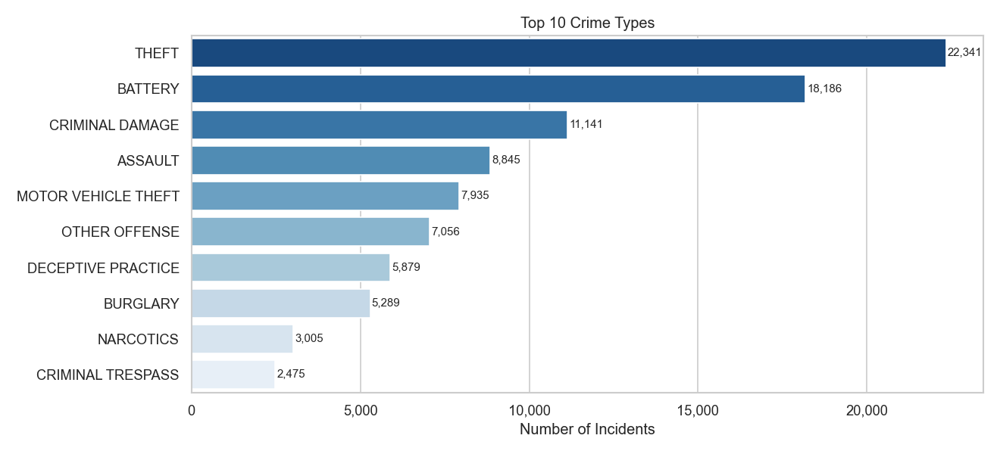

---

## 3. Data quality — missing values

Counts and percentages (notebook §4):

| Column | Null count | Null % |
|--------|-----------:|-------:|
| location_description | 497 | 0.50 |
| latitude | 61 | 0.06 |
| longitude | 61 | 0.06 |
| community_area | 3 | ~0.00 |
| primary_type, district, ward, arrest, domestic | 0 | 0.00 |

**Implications:** Coordinate-based maps or distance models should drop or impute the small share of null lat/lon. Text or NLP on `location_description` should handle ~0.5% missing.

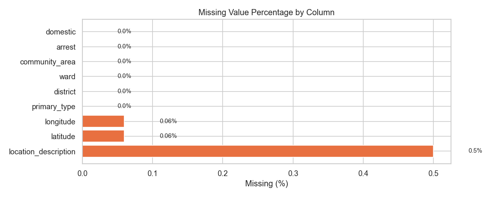

---

## 4. Time structure

### 4.1 Daily incidents (calendar day)

From notebook printout after the daily aggregation plot:

- **Busiest day (sample):** 2025-11-15 — **725** incidents  
- **Quietest day (sample):** 2026-04-25 — **18** incidents  
- **Mean crimes per day** (non-null dates): **578.0**

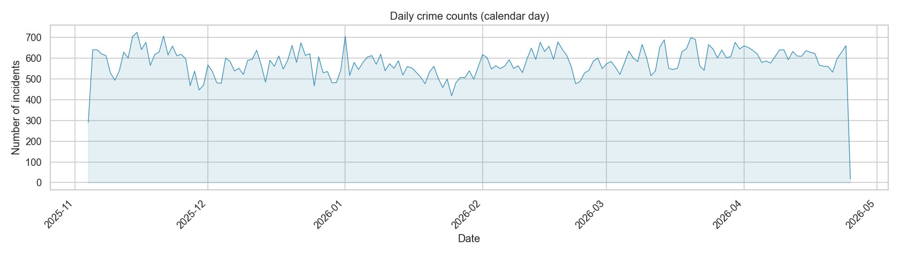

### 4.2 Yearly aggregate

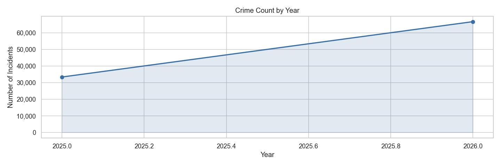

### 4.3 Hourly distribution

**Peak hours (top 2 by volume)** from the computed summary table in the notebook: **00:00** and **12:00** (interpret in light of how `date`/`date_ts` are parsed and whether midnight bins aggregate boundary effects).

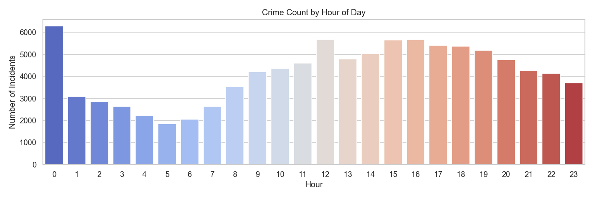

### 4.4 Day-of-week × hour

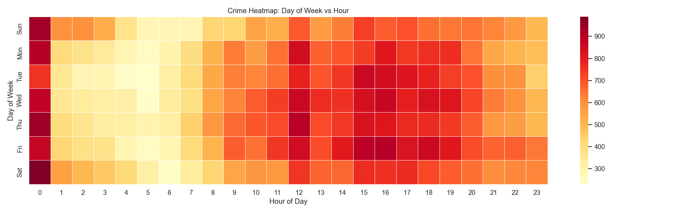

---

## 5. Administrative and geographic distributions

- **Districts (top 3 by volume):** **12, 8, 2** (from summary table).

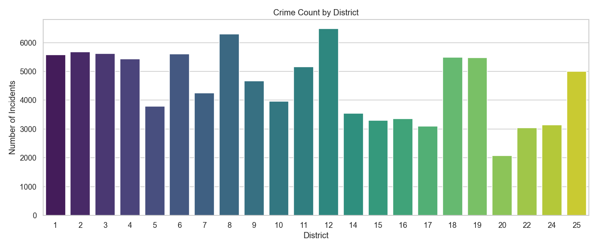

---

## 6. Categorical context

- **Domestic vs non-domestic** and **arrest vs no arrest** (pie charts below).  
- **Top location descriptions** (bar chart below).  
- **Most common location (modal):** **STREET** — **26,850** incidents (summary table).

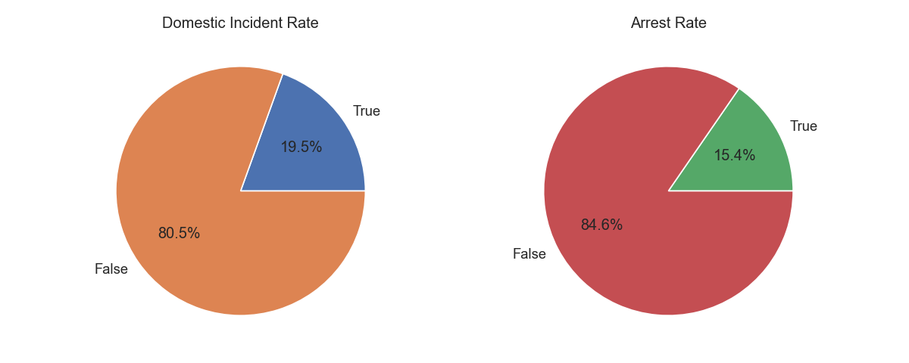

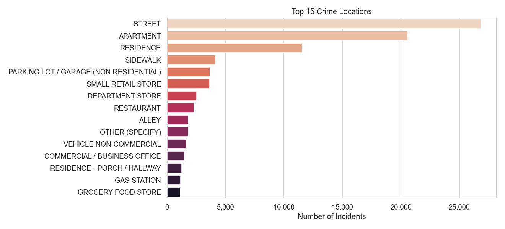

---

## 7. Numeric variables

Spark **`summary()`** is applied in the notebook to: `latitude`, `longitude`, `beat`, `ward`, `community_area` (see §13 cell output for full count/mean/std/min/max rows).

Histograms use a sampled subset; the correlation heatmap is **descriptive only** (not causal).

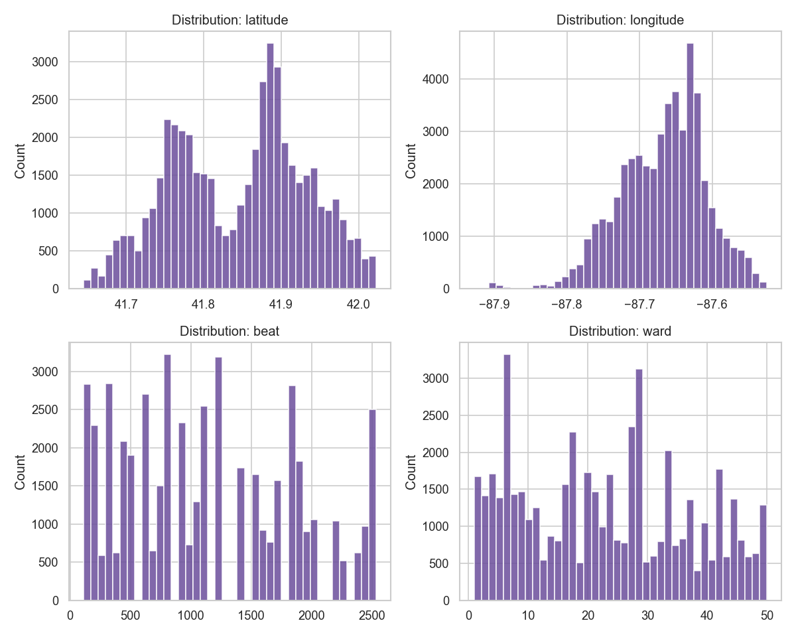

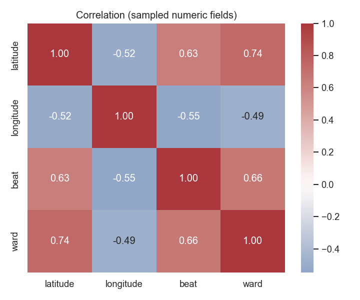

---

## 8. Consolidated findings table (from notebook outputs)

Values below merge the **§14 Markdown summary** with the **daily** statistics printed in §7. Re-run the notebook to refresh; if your local summary cell includes **busiest/quietest day** rows, they supersede this static merge.

| Topic | Detail |
|-------|--------|
| Volume | 100,000 rows |
| Years in sample | 2025–2026 |
| Busiest calendar day | 2025-11-15 (725 incidents) |
| Quietest calendar day | 2026-04-25 (18 incidents) |
| Mean incidents/day | ~578 (where `date_ts` non-null) |
| Top crime type | THEFT (22,341; ~22.3% of rows) |
| Peak hours (top 2) | 00:00, 12:00 |
| Top districts | 12, 8, 2 |
| Arrest rate | 15.4% (15,404) |
| Domestic share | 19.5% (19,502) |
| Top location | STREET (26,850) |
| Largest missingness | `location_description` — 0.5% |

---

## 9. Figures index

Paths below are **repository-relative**. This report’s images point at **`dashboard/figures/from-csv/`** (CSV notebook run). Delta runs write the same filenames under **`dashboard/figures/from-delta-lake/silver/`** or **`.../gold/`** so they never overwrite `from-csv/`.

| File | Content |
|------|---------|
| `dashboard/figures/from-csv/missing_values.png` | Missing % by column |
| `dashboard/figures/from-csv/top10_crime_types.png` | Top primary types |
| `dashboard/figures/from-csv/yearly_trend.png` | Counts by year |
| `dashboard/figures/from-csv/daily_trend.png` | Counts by calendar day |
| `dashboard/figures/from-csv/hourly_distribution.png` | Counts by hour |
| `dashboard/figures/from-csv/district_heatmap.png` | Counts by district |
| `dashboard/figures/from-csv/weekday_hour_heatmap.png` | DOW × hour intensity |
| `dashboard/figures/from-csv/domestic_arrest_comparison.png` | Pie charts |
| `dashboard/figures/from-csv/location_description_distribution.png` | Top locations |
| `dashboard/figures/from-csv/numeric_distributions.png` | Numeric histograms |
| `dashboard/figures/from-csv/numeric_correlation_heatmap.png` | Sample correlation matrix |

---

## 10. Reproducibility and next steps

1. Open `notebooks/03_eda.ipynb` and **Run All** from the repository root or `notebooks/` (paths resolve via `_repo_root()`). Figures save to `dashboard/figures/from-csv/` when using CSV.  
2. For **Delta**, set `delta_silver` or `delta_gold`, install `delta-spark`, ensure tables exist under `./delta`, then run the notebook; figures go to `dashboard/figures/from-delta-lake/silver/` or `.../gold/`. See `scripts/run_03_eda.sh`.  
3. Optionally refresh this report after a run, or automate export (nbconvert / nbformat → Markdown or PDF).

---

## 11. Limitations

- **Sample vs population:** Statistics describe the **loaded CSV sample**, not necessarily all Chicago crime history.  
- **Time parsing:** `date_ts` derivation depends on the `date` column format; re-check if the raw source changes.  
- **Correlation:** Numeric correlations are on a **sample** and are **not** causal.  
- **Peak hours at midnight:** May reflect timestamp rounding, reporting bias, or data extraction — worth validating on the Delta pipeline’s canonical timestamp.

---

*This document is a documentation artifact derived from `03_eda.ipynb`. Update it after major notebook or data changes.*
